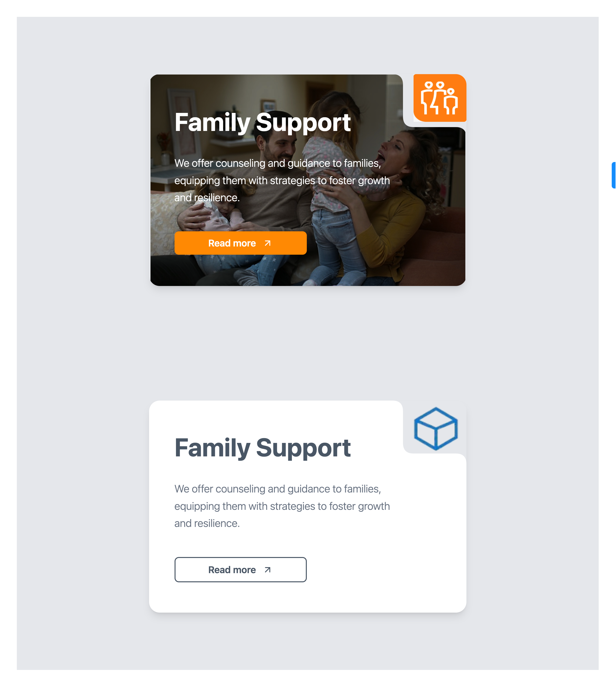

# Card

A modern, responsive UI component built using **React** and **Tailwind CSS**, designed to showcase a service card for family support or social service features. The component highlights key content with bold headings, a clear call-to-action button, and a visually appealing layout that works across screen sizes.

---

## 🔗 Live Preview

[**View Live Demo**](https://your-live-demo-link.com)  
_(Replace with your actual deployed site or CodeSandbox/Netlify/Vercel link)_

---

## 📸 Screenshot



> The design features a full-screen background image, L-shaped white overlay, and centered content with headline, description, and CTA button.

---

## 🔗 Live Preview

### 🌐 Hosted Demo

[**Live Preview Here**](https://super-narwhal-4c4f0a.netlify.app/)

## 🚀 Getting Started

### 1. Clone the repository

```bash
git clone https://github.com/your-username/family-support-ui.git
cd family-support-ui

npm install
# or
yarn install

npm run dev
# or
yarn dev

```

### 🛠️ Tech Stack

React

Tailwind CSS

Vite (or Next.js / CRA — update based on your actual setup)

### Project Structure

css
Copy code
src/
├── components/
│ └── SupportCard.jsx
├── assets/
│ └── background.jpg
└── App.jsx

### 🙌 Contributing

Pull requests are welcome. For major changes, please open an issue first to discuss what you would like to change.

🧾 License
MIT

yaml
Copy code

---

### ✅ What You Need To Do:

1. Replace:
   - `https://your-live-demo-link.com` with your actual preview (e.g., Vercel, Netlify, or CodeSandbox link).
   - `./screenshot.jpg` with your exported screenshot (name it `screenshot.jpg` and place it in the project root).
   - Update the repo URL and file paths if necessary.
2. If you're not using `Vite`, change the setup instructions accordingly.

MIT License

Copyright (c) 2025 Winnifred Itse Kaze

Permission is hereby granted, free of charge, to any person obtaining a copy  
of this software and associated documentation files (the "Software"), to deal  
in the Software without restriction, including without limitation the rights  
to use, copy, modify, merge, publish, distribute, sublicense, and/or sell  
copies of the Software, and to permit persons to whom the Software is  
furnished to do so, subject to the following conditions:

The above copyright notice and this permission notice shall be included in all  
copies or substantial portions of the Software.

THE SOFTWARE IS PROVIDED "AS IS", WITHOUT WARRANTY OF ANY KIND, EXPRESS OR  
IMPLIED, INCLUDING BUT NOT LIMITED TO THE WARRANTIES OF MERCHANTABILITY,  
FITNESS FOR A PARTICULAR PURPOSE AND NONINFRINGEMENT. IN NO EVENT SHALL THE  
AUTHORS OR COPYRIGHT HOLDERS BE LIABLE FOR ANY CLAIM, DAMAGES OR OTHER  
LIABILITY, WHETHER IN AN ACTION OF CONTRACT, TORT OR OTHERWISE, ARISING FROM,  
OUT OF OR IN CONNECTION WITH THE SOFTWARE OR THE USE OR OTHER DEALINGS IN THE  
SOFTWARE.
